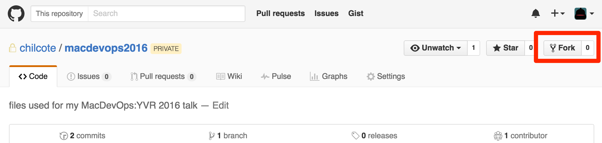
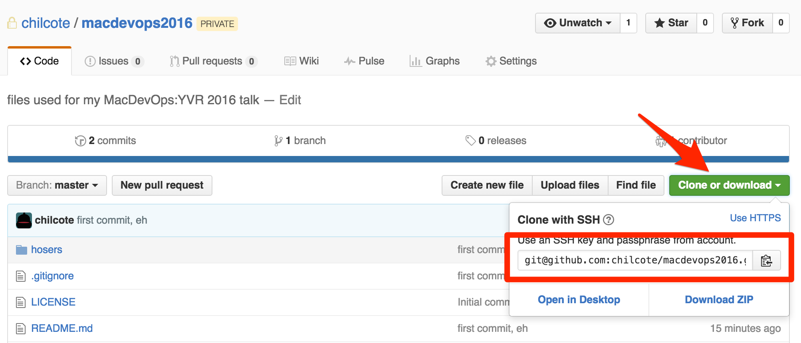
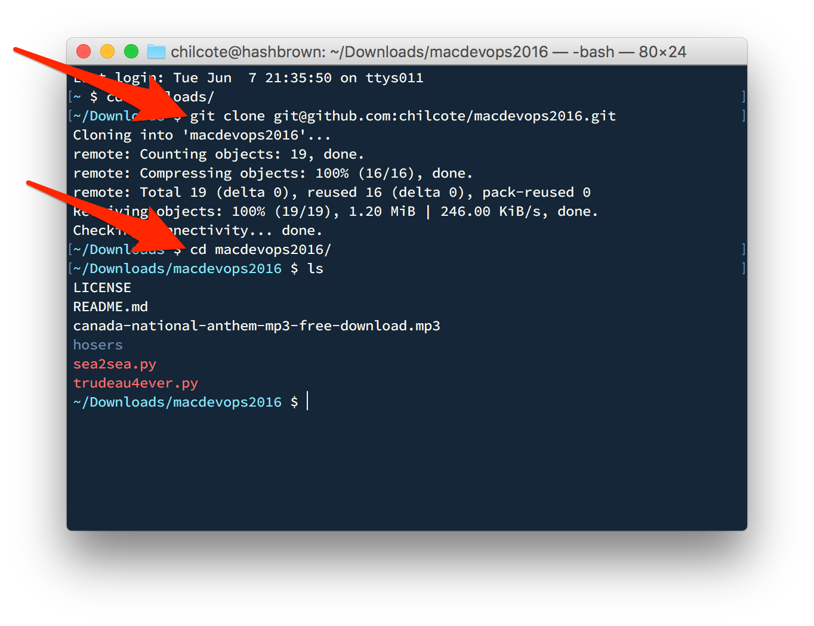
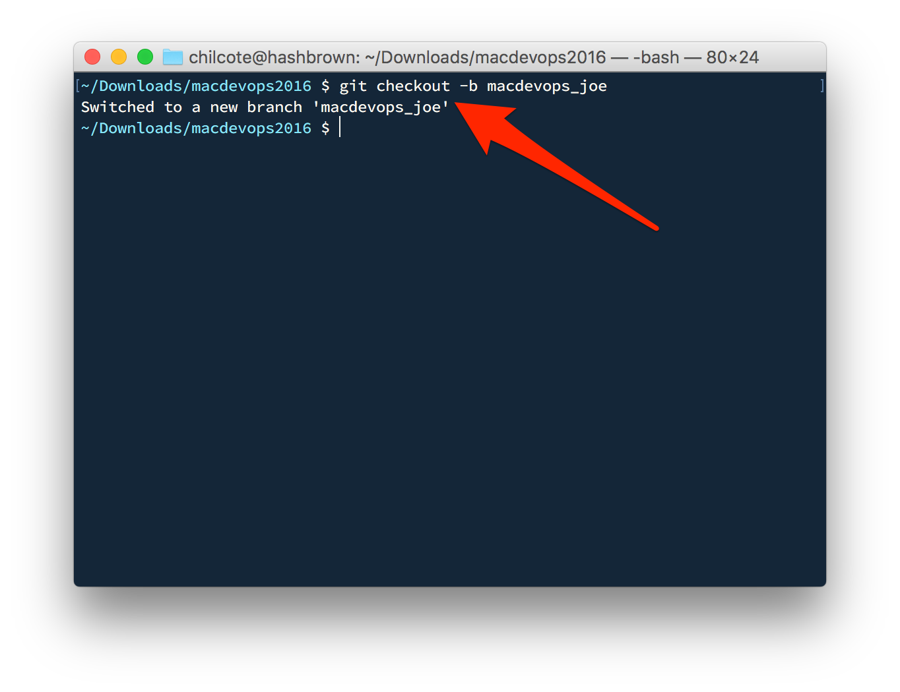
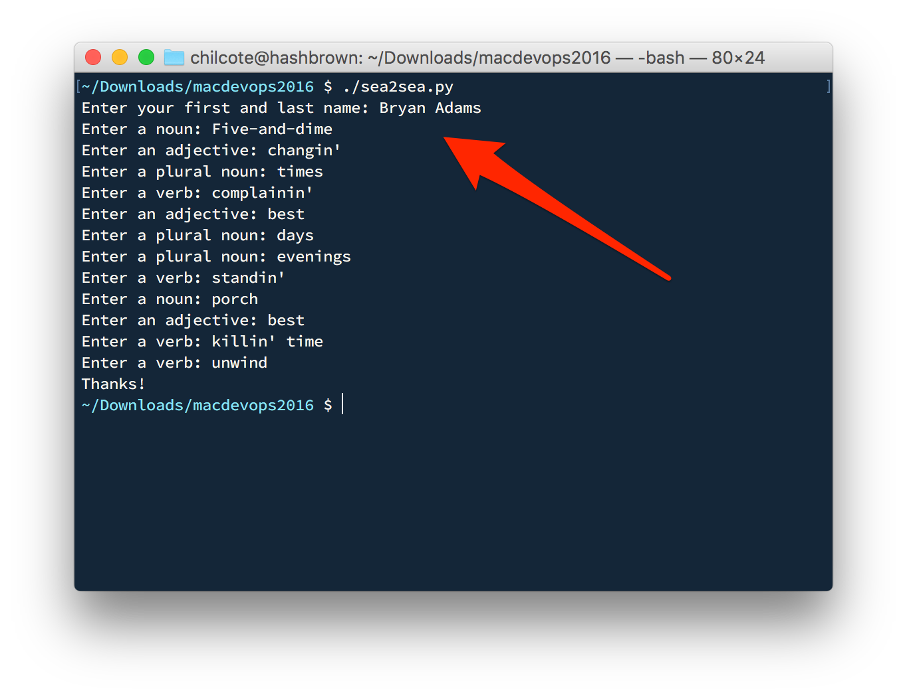
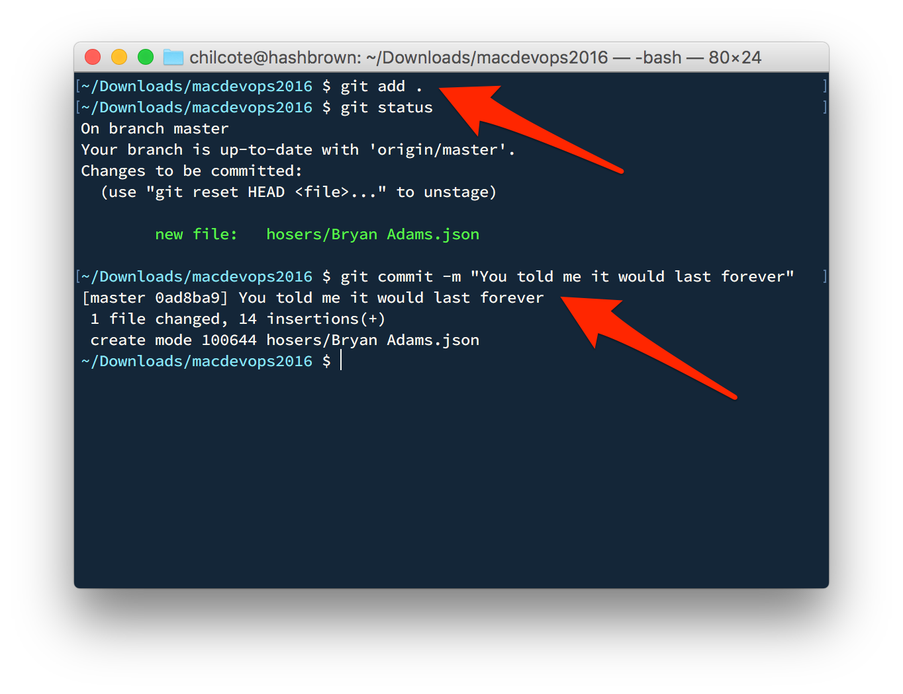
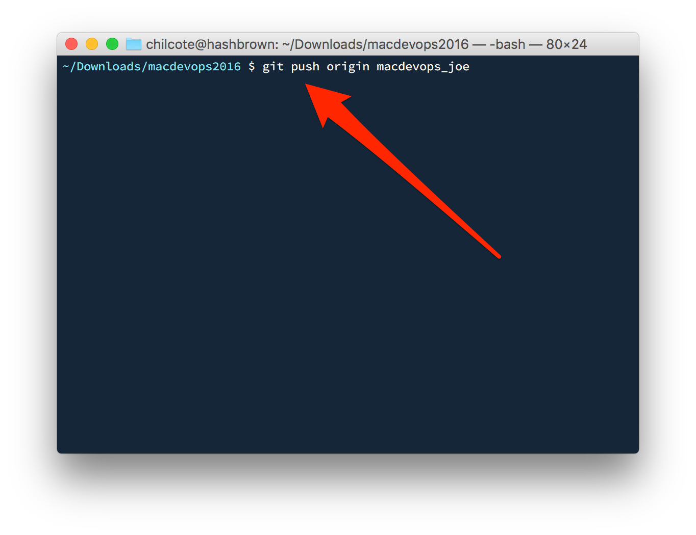
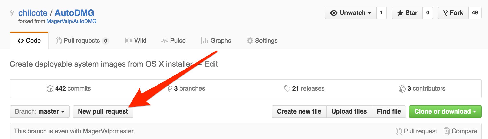

MacDevOps:YVR 2016
==================

The objective is to fork this project, create a file using an interactive script, commit your changes, and create a pull request. 

## Step 1. Fork this project by clicking the "Fork" Button in the upper right hand corner.

## Step 2. Click the "Clone or Download" button and copy the clone URL to your clipboard.

## Step 3. Open Terminal.app and clone the repo locally.

## Step 4. Create a new branch from which to work.

## Step 5. Run the `sea2sea.py` script to generate data.

## Step 6. Commit your changes.

## Step 7. Push your changes back to the server using your working branch.

## Step 8. Back on Github, click the "New pull request"

## Follow the steps to complete the Pull Request, and wait for it to be merged.

